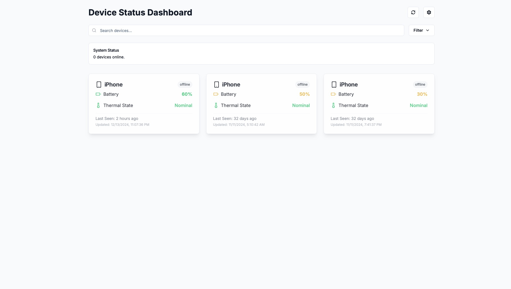

# Device Status Dashboard

## Overview
The **Device Status Dashboard** is a web application that allows users to monitor the charging status and thermal state of their iOS devices in real time. It seamlessly integrates with an iOS app and Firebase to provide up-to-date information about battery levels, device status, and thermal conditions.

## Features
- **Real-Time Monitoring:** View battery percentage and thermal state of connected devices.
- **Device Status:** Displays if devices are online or offline.
- **Data Synchronization:** Automatically pulls data from Firebase, ensuring accurate and current device information.
- **Search and Filtering:** Easily find and filter devices.
- **Last Seen Information:** Provides timestamped updates of device status.

## How It Works
1. **iOS App Integration:** Users install the companion iOS app on their devices.
2. **Automatic Data Push:** The iOS app automatically pushes device data (e.g., battery level, thermal state, and status) to Firebase.
3. **Web Dashboard:** The web dashboard continuously fetches data from Firebase to display device information.

## Installation and Setup

### Prerequisites
1. An active Firebase project.
2. The companion iOS app installed on the devices you want to monitor.
3. A modern web browser to access the dashboard.

### Setup Instructions

#### Firebase Configuration
1. Create a Firebase project in your [Firebase Console](https://console.firebase.google.com/).
2. Add your Firebase project's configuration details to both the iOS app and the web app.
   - **iOS App:** Configure the Firebase SDK in the app by adding your `GoogleService-Info.plist`.
   - **Web App:** Update the `firebaseConfig` object in the web app's JavaScript code with your Firebase API keys and project details.

#### Deploy the Web App
1. Clone the repository:
   ```bash
   git clone <repository_url>
   cd <repository_folder>
   ```
2. Install dependencies:
   ```bash
   npm install
   ```
3. Start the development server:
   ```bash
   npm start
   ```
4. (Optional) Build and deploy for production:
   ```bash
   npm run build
   ```
   Deploy the built files to your web server or hosting service (e.g., Firebase Hosting).

#### iOS App Installation
1. Download the iOS app from the App Store or directly from the provided link.
2. Open the app, log in, and allow necessary permissions for data collection.

## Usage
1. Open the web dashboard in your browser.
2. Log in using your credentials.
3. View all connected devices and their statuses.
   - **Battery Percentage:** Displays the current charge level of each device.
   - **Thermal State:** Indicates the current thermal condition (e.g., Nominal).
   - **Last Seen:** Shows when the device was last online.
4. Use the search bar or filters to find specific devices.

## Technologies Used
- **Frontend:** React.js, HTML, CSS
- **Backend:** Firebase Realtime Database
- **Mobile App:** Swift (iOS)
- **Hosting:** Firebase Hosting

## Troubleshooting
- **No Devices Showing:** Ensure the iOS app is installed and the device has an active internet connection.
- **Outdated Information:** Check the Firebase connection and ensure the iOS app is pushing data correctly.
- **Dashboard Not Loading:** Verify your Firebase configuration and web hosting setup.

## Screenshot


